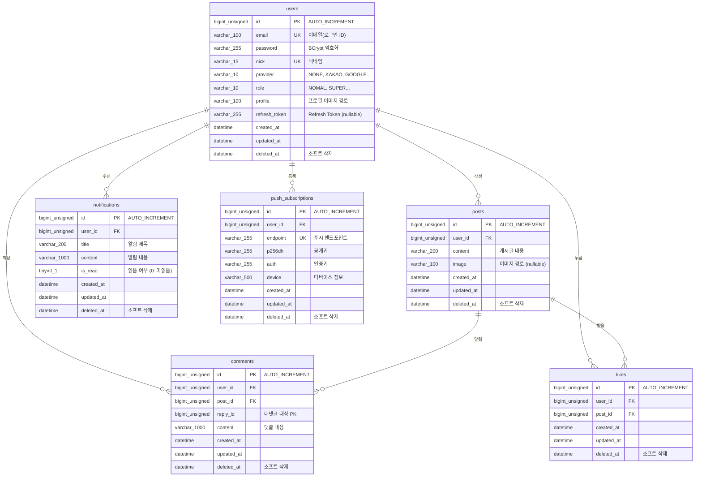

# 02. ERD & 데이터베이스

## 1. ERD 다이어그램



> **v1 (현재):** `users`, `posts` 테이블만 사용
> **v2 (예정):** `comments`, `likes`, `notifications`, `push_subscriptions` 추가

---

## 2. 테이블 스키마

### 2-1. users

| 컬럼 | 타입 | NULL | 제약 | 설명 |
|------|------|------|------|------|
| `id` | BIGINT UNSIGNED | NO | PK, AUTO_INCREMENT | 유저 PK |
| `email` | VARCHAR(100) | NO | UNIQUE | 이메일 (로그인 ID) |
| `password` | VARCHAR(255) | NO | | BCrypt 암호화된 비밀번호 |
| `nick` | VARCHAR(15) | NO | UNIQUE | 닉네임 |
| `provider` | VARCHAR(10) | NO | | 로그인 제공자 (`NONE`, `KAKAO`, `GOOGLE`) |
| `role` | VARCHAR(10) | NO | | 권한 (`NOMAL`, `SUPER`) |
| `profile` | VARCHAR(100) | NO | | 프로필 이미지 경로 |
| `refresh_token` | VARCHAR(255) | YES | | Refresh Token 저장소 |
| `created_at` | DATETIME | YES | | 생성 시각 |
| `updated_at` | DATETIME | YES | | 수정 시각 |
| `deleted_at` | DATETIME | YES | | 소프트 삭제 시각 |

> `refresh_token`을 DB에 저장하는 이유: 로그아웃 또는 강제 만료 시 DB의 값을 `NULL`로 업데이트해서 토큰을 무효화한다.

---

### 2-2. posts

| 컬럼 | 타입 | NULL | 제약 | 설명 |
|------|------|------|------|------|
| `id` | BIGINT UNSIGNED | NO | PK, AUTO_INCREMENT | 게시글 PK |
| `user_id` | BIGINT UNSIGNED | NO | FK → users.id | 작성자 |
| `content` | VARCHAR(200) | NO | | 게시글 내용 |
| `image` | VARCHAR(100) | YES | | 이미지 파일 경로 |
| `created_at` | DATETIME | YES | | 생성 시각 |
| `updated_at` | DATETIME | YES | | 수정 시각 |
| `deleted_at` | DATETIME | YES | | 소프트 삭제 시각 |

---

### 2-3. comments *(v2 예정)*

| 컬럼 | 타입 | NULL | 제약 | 설명 |
|------|------|------|------|------|
| `id` | BIGINT UNSIGNED | NO | PK, AUTO_INCREMENT | 댓글 PK |
| `user_id` | BIGINT UNSIGNED | NO | FK → users.id | 작성자 |
| `post_id` | BIGINT UNSIGNED | NO | FK → posts.id | 대상 게시글 |
| `content` | VARCHAR(1000) | NO | | 댓글 내용 |
| `reply_id` | BIGINT UNSIGNED | NO | | 대댓글 대상 댓글 PK (0이면 최상위 댓글) |
| `created_at` | DATETIME | YES | | 생성 시각 |
| `updated_at` | DATETIME | YES | | 수정 시각 |
| `deleted_at` | DATETIME | YES | | 소프트 삭제 시각 |

---

### 2-4. likes *(v2 예정)*

| 컬럼 | 타입 | NULL | 제약 | 설명 |
|------|------|------|------|------|
| `id` | BIGINT UNSIGNED | NO | PK, AUTO_INCREMENT | 좋아요 PK |
| `user_id` | BIGINT UNSIGNED | NO | FK → users.id | 누른 유저 |
| `post_id` | BIGINT UNSIGNED | NO | FK → posts.id | 대상 게시글 |
| `created_at` | DATETIME | YES | | 생성 시각 |
| `updated_at` | DATETIME | YES | | 수정 시각 |
| `deleted_at` | DATETIME | YES | | 소프트 삭제 시각 |

---

### 2-5. notifications *(v2 예정)*

| 컬럼 | 타입 | NULL | 제약 | 설명 |
|------|------|------|------|------|
| `id` | BIGINT UNSIGNED | NO | PK, AUTO_INCREMENT | 알림 PK |
| `user_id` | BIGINT UNSIGNED | NO | FK → users.id | 수신 유저 |
| `title` | VARCHAR(200) | NO | | 알림 제목 |
| `content` | VARCHAR(1000) | NO | | 알림 내용 |
| `is_read` | TINYINT(1) | NO | DEFAULT 0 | 읽음 여부 (0: 미읽음, 1: 읽음) |
| `created_at` | DATETIME | YES | | 생성 시각 |
| `updated_at` | DATETIME | YES | | 수정 시각 |
| `deleted_at` | DATETIME | YES | | 소프트 삭제 시각 |

---

### 2-6. push_subscriptions *(v2 예정)*

| 컬럼 | 타입 | NULL | 제약 | 설명 |
|------|------|------|------|------|
| `id` | BIGINT UNSIGNED | NO | PK, AUTO_INCREMENT | 구독 PK |
| `user_id` | BIGINT UNSIGNED | NO | FK | 등록 유저 |
| `endpoint` | VARCHAR(255) | NO | UNIQUE | 브라우저 푸시 엔드포인트 |
| `p256dh` | VARCHAR(255) | NO | | 공개키 |
| `auth` | VARCHAR(255) | NO | | 인증키 |
| `device` | VARCHAR(500) | NO | | 디바이스 정보 |
| `created_at` | DATETIME | YES | | 생성 시각 |
| `updated_at` | DATETIME | YES | | 수정 시각 |
| `deleted_at` | DATETIME | YES | | 소프트 삭제 시각 |

---

## 3. 테이블 간 관계 (FK)

| FK 이름 | 테이블 | 컬럼 | 참조 | ON DELETE |
|---------|--------|------|------|-----------|
| `fk_posts_user_id` | posts | user_id | users.id | CASCADE |
| `fk_comments_user_id` | comments | user_id | users.id | CASCADE |
| `fk_comments_post_id` | comments | post_id | posts.id | CASCADE |
| `fk_likes_user_id` | likes | user_id | users.id | CASCADE |
| `fk_likes_post_id` | likes | post_id | posts.id | CASCADE |
| `fk_notifications_user_id` | notifications | user_id | users.id | CASCADE |

> `ON DELETE CASCADE`: 부모 레코드(users, posts)가 삭제되면 자식 레코드도 자동으로 삭제된다.
> 단, 이 프로젝트에서는 실제 삭제 대신 소프트 삭제(`deleted_at`)를 사용하므로 CASCADE가 직접 발동하는 경우는 드물다.

---

## 4. 소프트 삭제 패턴

모든 테이블에는 `deleted_at` 컬럼이 있다. 레코드를 실제로 `DELETE`하지 않고 `deleted_at`에 시각을 기록하는 방식으로 삭제를 처리한다.

**삭제 처리 (PostMapper.xml)**
```xml
<update id="destroy">
    UPDATE posts
    SET
        updated_at = NOW()
      , deleted_at = NOW()
    WHERE
        id = #{id}
</update>
```

**조회 시 삭제된 데이터 제외 (UserMapper.xml)**
```xml
<select id="findByPk" resultMap="UserResultMap">
    SELECT * FROM users
    WHERE deleted_at IS NULL   <!-- 소프트 삭제된 레코드 제외 -->
      AND id = #{id}
</select>
```

**소프트 삭제의 장점**
- 실수로 삭제한 데이터를 복구할 수 있다
- 삭제 시각 기준의 통계나 감사(audit) 로그를 남길 수 있다
- 외래 키 관계가 깨지지 않아 데이터 정합성을 유지할 수 있다

---

## 5. MyBatis ResultMap — DB ↔ Java 필드 매핑

DB 컬럼명은 `snake_case`, Java 필드명은 `camelCase`를 사용한다.
MyBatis는 기본적으로 이름이 정확히 일치해야 매핑하므로, `<resultMap>`으로 명시적으로 연결한다.

**UserMapper.xml — ResultMap 예시**
```xml
<resultMap id="UserResultMap" type="com.msa4meerkatgram.domain.user.entities.User">
    <result column="id"            property="id" />
    <result column="email"         property="email" />
    <result column="nick"          property="nick" />
    <result column="refresh_token" property="refreshToken" />  <!-- snake → camel -->
    <result column="created_at"    property="createdAt" />     <!-- snake → camel -->
    <result column="updated_at"    property="updatedAt" />
    <result column="deleted_at"    property="deletedAt" />
    ...
</resultMap>
```

**매핑 대응표 (users 기준)**

| DB 컬럼 (snake_case) | Java 필드 (camelCase) |
|----------------------|-----------------------|
| `refresh_token` | `refreshToken` |
| `created_at` | `createdAt` |
| `updated_at` | `updatedAt` |
| `deleted_at` | `deletedAt` |

**useGeneratedKeys — INSERT 후 자동 PK 반환**

```xml
<insert
    id="create"
    parameterType="com.msa4meerkatgram.domain.user.entities.User"
    useGeneratedKeys="true"
    keyProperty="id"
>
    INSERT INTO users (...) VALUES (...)
</insert>
```

- `useGeneratedKeys="true"`: DB가 AUTO_INCREMENT로 생성한 PK 값을 사용하겠다는 선언
- `keyProperty="id"`: INSERT 후 생성된 PK를 Java 객체의 `id` 필드에 자동으로 주입한다
- 덕분에 INSERT 직후 별도 SELECT 없이 `user.getId()`로 새 PK를 바로 사용할 수 있다
